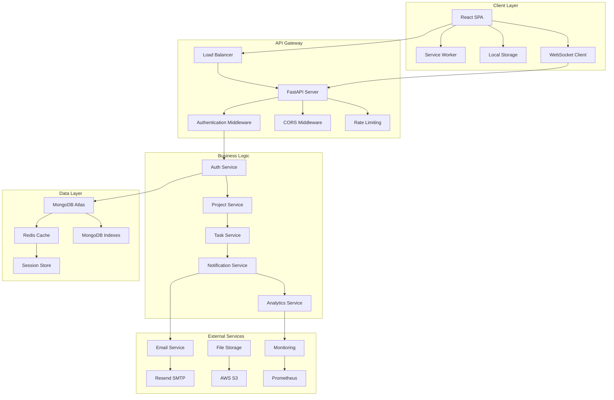
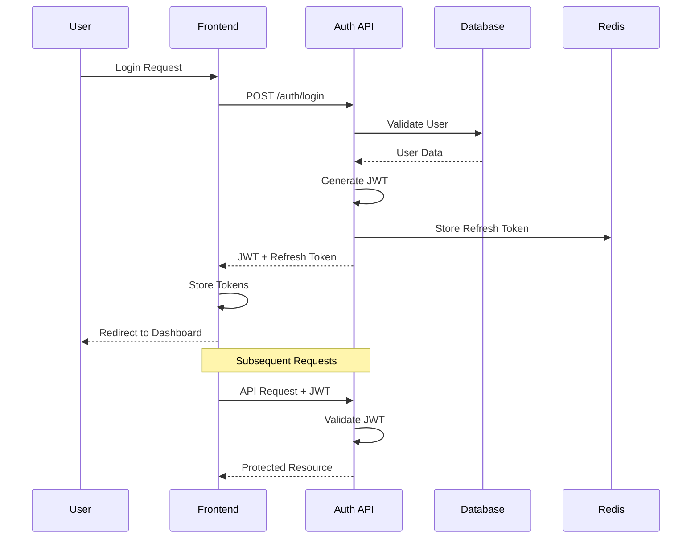
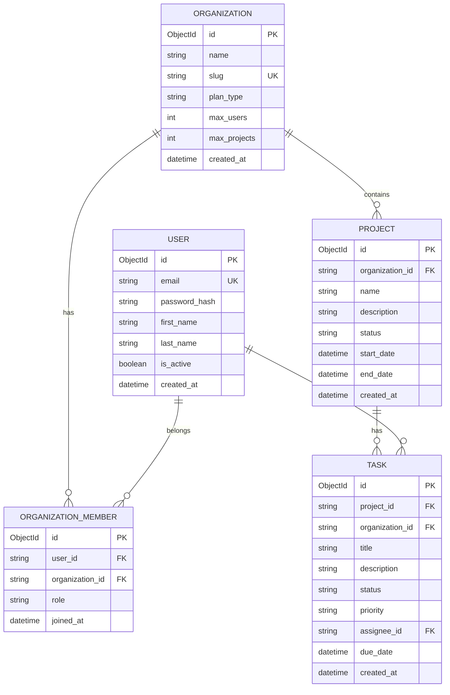
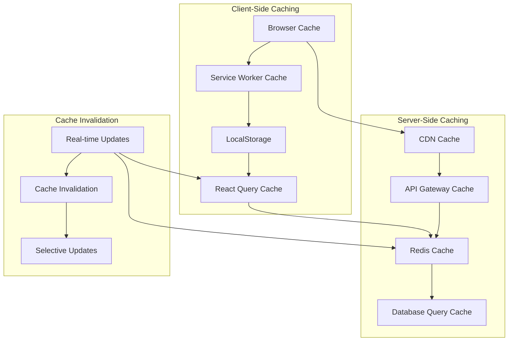
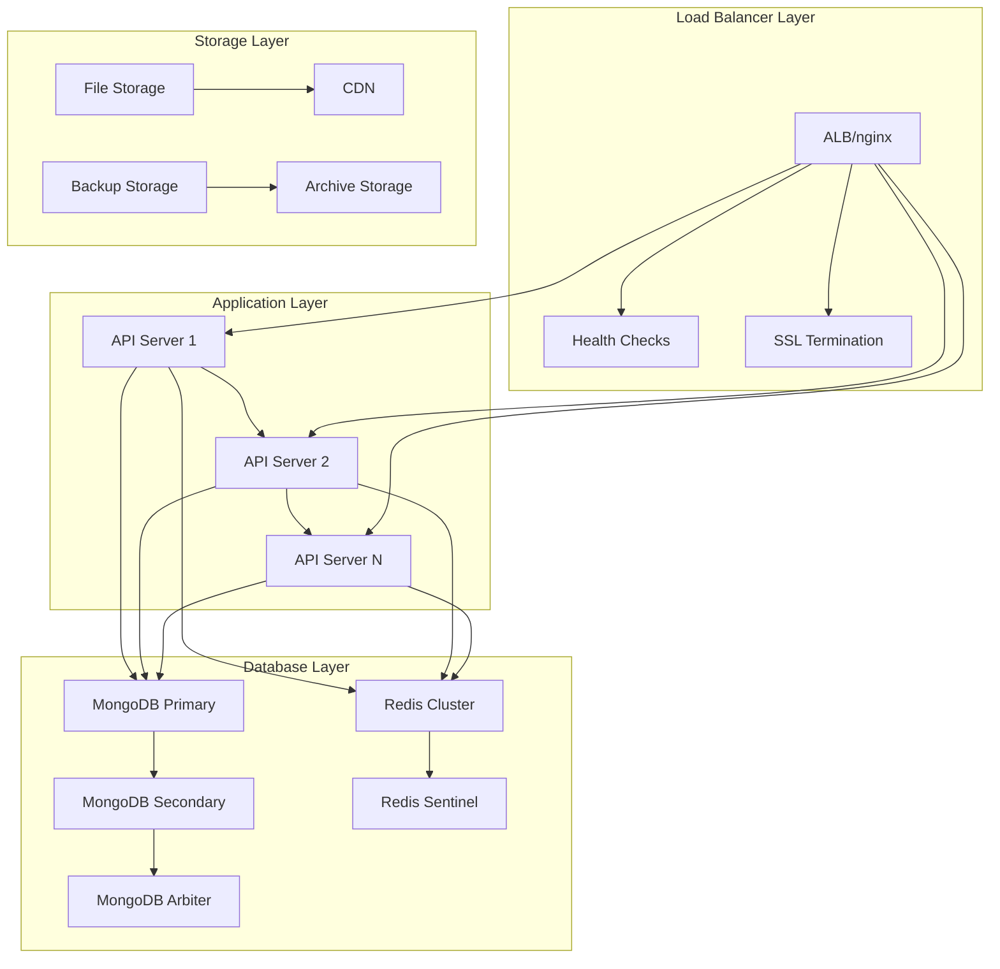
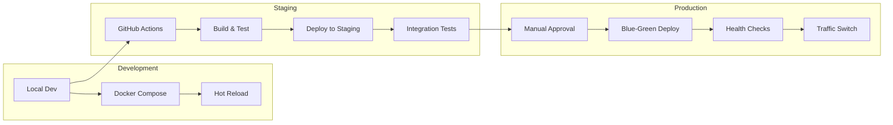

# 🏛️ Technical Architecture Documentation

## Taskflow SaaS Platform - System Design & Architecture

> **Comprehensive technical architecture guide covering system design, data flow, security layers, and scalability patterns**

---

## 📋 Architecture Overview



---

## 🗂️ System Components

### Frontend Architecture

#### **Component Hierarchy**
```
App
├── AuthProvider
│   ├── Router
│   │   ├── PublicRoutes
│   │   │   ├── LandingPage
│   │   │   ├── LoginPage
│   │   │   └── SignupPage
│   │   └── ProtectedRoutes
│   │       ├── Sidebar
│   │       ├── Header
│   │       └── MainContent
│   │           ├── Dashboard
│   │           ├── Projects
│   │           │   ├── ProjectsList
│   │           │   ├── ProjectDetail
│   │           │   └── KanbanBoard
│   │           ├── Tasks
│   │           ├── Team
│   │           ├── Reports
│   │           └── Settings
│   └── ToastProvider
└── ErrorBoundary
```

#### **Data Flow Architecture**
```typescript
// Unidirectional Data Flow
interface DataFlow {
  // 1. User Action
  userAction: Event;
  
  // 2. State Update
  stateUpdate: (action: Action) => State;
  
  // 3. API Call (if needed)
  apiCall: (data: ApiData) => Promise<Response>;
  
  // 4. State Synchronization
  stateSync: (response: Response) => State;
  
  // 5. UI Re-render
  rerender: (state: State) => JSX.Element;
}
```

### Backend Architecture

#### **Service Layer Pattern**
```python
# Service Layer Abstraction
class BaseService:
    def __init__(self, db: AsyncIOMotorDatabase):
        self.db = db
    
    async def create(self, data: BaseModel) -> Dict:
        """Generic create operation"""
        pass
    
    async def get_by_id(self, id: str) -> Dict:
        """Generic read operation"""
        pass
    
    async def update(self, id: str, data: BaseModel) -> Dict:
        """Generic update operation"""
        pass
    
    async def delete(self, id: str) -> bool:
        """Generic delete operation"""
        pass

class ProjectService(BaseService):
    async def get_projects_for_organization(
        self, 
        org_id: str, 
        filters: ProjectFilters = None
    ) -> List[Dict]:
        """Business logic specific to projects"""
        query = {"organization_id": org_id}
        
        if filters:
            if filters.status:
                query["status"] = {"$in": filters.status}
            if filters.search:
                query["name"] = {"$regex": filters.search, "$options": "i"}
        
        projects = await self.db.projects.find(query).to_list(100)
        
        # Add task counts
        for project in projects:
            project["task_count"] = await self.db.tasks.count_documents({
                "project_id": str(project["_id"])
            })
        
        return projects
```

#### **Repository Pattern**
```python
# Data Access Layer
class BaseRepository:
    def __init__(self, collection: AsyncIOMotorCollection):
        self.collection = collection
    
    async def create(self, document: Dict) -> str:
        result = await self.collection.insert_one(document)
        return str(result.inserted_id)
    
    async def find_by_id(self, id: str) -> Optional[Dict]:
        return await self.collection.find_one({"_id": ObjectId(id)})
    
    async def find_by_filter(self, filter: Dict) -> List[Dict]:
        return await self.collection.find(filter).to_list(100)
    
    async def update_by_id(self, id: str, update: Dict) -> bool:
        result = await self.collection.update_one(
            {"_id": ObjectId(id)}, 
            {"$set": update}
        )
        return result.modified_count > 0
    
    async def delete_by_id(self, id: str) -> bool:
        result = await self.collection.delete_one({"_id": ObjectId(id)})
        return result.deleted_count > 0

class ProjectRepository(BaseRepository):
    def __init__(self, db: AsyncIOMotorDatabase):
        super().__init__(db.projects)
    
    async def find_by_organization(self, org_id: str) -> List[Dict]:
        return await self.collection.find(
            {"organization_id": org_id}
        ).to_list(100)
```

---

## 🔐 Security Architecture

### Multi-Layer Security Model

```
┌─────────────────────────────────────────────────────────────┐
│                    Client Security Layer                    │
│  • CSP Headers  • HTTPS Only  • XSS Protection           │
│  • Input Validation  • Sanitization  • CSRF Tokens       │
└─────────────────────────────────────────────────────────────┘
                                │
                                ▼
┌─────────────────────────────────────────────────────────────┐
│                   Network Security Layer                    │
│  • WAF (Web Application Firewall)  • DDoS Protection      │
│  • Rate Limiting  • IP Whitelisting  • SSL/TLS           │
└─────────────────────────────────────────────────────────────┘
                                │
                                ▼
┌─────────────────────────────────────────────────────────────┐
│                 Application Security Layer                  │
│  • JWT Authentication  • RBAC  • API Validation          │
│  • Session Management  • Password Hashing                │
└─────────────────────────────────────────────────────────────┘
                                │
                                ▼
┌─────────────────────────────────────────────────────────────┐
│                   Data Security Layer                       │
│  • Encryption at Rest  • Encryption in Transit           │
│  • Database Isolation  • Backup Encryption               │
└─────────────────────────────────────────────────────────────┘
```

### Authentication Flow



### Authorization Matrix

| **Resource** | **Owner** | **Admin** | **Member** | **Viewer** |
|--------------|-----------|-----------|------------|------------|
| **Organization Settings** | ✅ CRUD | ✅ Read/Update | ❌ None | ❌ None |
| **Team Management** | ✅ CRUD | ✅ CRUD | ❌ Read Only | ❌ Read Only |
| **Project Management** | ✅ CRUD | ✅ CRUD | ✅ CRUD | ❌ Read Only |
| **Task Management** | ✅ CRUD | ✅ CRUD | ✅ CRUD | ❌ Read Only |
| **Reports & Analytics** | ✅ All | ✅ All | ✅ Limited | ❌ Basic |
| **Billing & Plans** | ✅ All | ❌ None | ❌ None | ❌ None |

---

## 📊 Database Design

### Entity Relationship Model



### Data Access Patterns

#### **Efficient Query Strategies**
```python
# Optimized Aggregation Pipeline
async def get_project_statistics(org_id: str):
    pipeline = [
        # Stage 1: Match organization projects
        {"$match": {"organization_id": org_id}},
        
        # Stage 2: Lookup tasks for each project
        {"$lookup": {
            "from": "tasks",
            "localField": "_id",
            "foreignField": "project_id",
            "as": "tasks"
        }},
        
        # Stage 3: Calculate project statistics
        {"$addFields": {
            "total_tasks": {"$size": "$tasks"},
            "completed_tasks": {
                "$size": {
                    "$filter": {
                        "input": "$tasks",
                        "cond": {"$eq": ["$$this.status", "completed"]}
                    }
                }
            },
            "completion_rate": {
                "$cond": {
                    "if": {"$gt": [{"$size": "$tasks"}, 0]},
                    "then": {
                        "$divide": [
                            {"$size": {"$filter": {
                                "input": "$tasks",
                                "cond": {"$eq": ["$$this.status", "completed"]}
                            }}},
                            {"$size": "$tasks"}
                        ]
                    },
                    "else": 0
                }
            }
        }},
        
        # Stage 4: Project results
        {"$project": {
            "name": 1,
            "status": 1,
            "total_tasks": 1,
            "completed_tasks": 1,
            "completion_rate": {"$multiply": ["$completion_rate", 100]},
            "created_at": 1
        }}
    ]
    
    return await db.projects.aggregate(pipeline).to_list(100)
```

#### **Index Strategy**
```javascript
// Strategic Database Indexes
db.users.createIndex({"email": 1}, {"unique": true});
db.users.createIndex({"created_at": -1});

db.organizations.createIndex({"slug": 1}, {"unique": true});
db.organizations.createIndex({"plan_type": 1});

db.organization_members.createIndex({"user_id": 1, "organization_id": 1});
db.organization_members.createIndex({"organization_id": 1, "role": 1});

db.projects.createIndex({"organization_id": 1});
db.projects.createIndex({"organization_id": 1, "status": 1});
db.projects.createIndex({"created_at": -1});

db.tasks.createIndex({"project_id": 1});
db.tasks.createIndex({"assignee_id": 1});
db.tasks.createIndex({"organization_id": 1, "status": 1});
db.tasks.createIndex({"due_date": 1});

// Compound indexes for complex queries
db.tasks.createIndex({"organization_id": 1, "status": 1, "priority": 1});
db.projects.createIndex({"organization_id": 1, "name": "text"});
```

---

## 🔄 Real-Time Architecture

### WebSocket Implementation

```python
# WebSocket Connection Manager
class ConnectionManager:
    def __init__(self):
        self.active_connections: Dict[str, List[WebSocket]] = {}
    
    async def connect(self, websocket: WebSocket, org_id: str):
        await websocket.accept()
        if org_id not in self.active_connections:
            self.active_connections[org_id] = []
        self.active_connections[org_id].append(websocket)
    
    def disconnect(self, websocket: WebSocket, org_id: str):
        if org_id in self.active_connections:
            self.active_connections[org_id].remove(websocket)
    
    async def broadcast_to_organization(self, org_id: str, message: dict):
        if org_id in self.active_connections:
            disconnected = []
            for connection in self.active_connections[org_id]:
                try:
                    await connection.send_json(message)
                except:
                    disconnected.append(connection)
            
            # Clean up disconnected clients
            for connection in disconnected:
                self.active_connections[org_id].remove(connection)

manager = ConnectionManager()

# WebSocket Event Types
class WebSocketEvent:
    TASK_CREATED = "task_created"
    TASK_UPDATED = "task_updated"
    TASK_DELETED = "task_deleted"
    PROJECT_UPDATED = "project_updated"
    USER_JOINED = "user_joined"
    USER_LEFT = "user_left"

# Real-time Task Updates
async def broadcast_task_update(org_id: str, task: dict, event_type: str):
    message = {
        "type": event_type,
        "data": task,
        "timestamp": datetime.utcnow().isoformat()
    }
    await manager.broadcast_to_organization(org_id, message)
```

### Event-Driven Updates

```typescript
// Frontend WebSocket Client
class WebSocketClient {
  private ws: WebSocket | null = null;
  private reconnectAttempts = 0;
  private maxReconnectAttempts = 5;
  
  constructor(
    private orgSlug: string,
    private onMessage: (event: WebSocketEvent) => void
  ) {}
  
  connect() {
    const token = localStorage.getItem('access_token');
    const wsUrl = `ws://localhost:8000/ws/${this.orgSlug}?token=${token}`;
    
    this.ws = new WebSocket(wsUrl);
    
    this.ws.onopen = () => {
      console.log('WebSocket connected');
      this.reconnectAttempts = 0;
    };
    
    this.ws.onmessage = (event) => {
      const data = JSON.parse(event.data);
      this.onMessage(data);
    };
    
    this.ws.onclose = () => {
      console.log('WebSocket disconnected');
      this.attemptReconnect();
    };
    
    this.ws.onerror = (error) => {
      console.error('WebSocket error:', error);
    };
  }
  
  private attemptReconnect() {
    if (this.reconnectAttempts < this.maxReconnectAttempts) {
      setTimeout(() => {
        this.reconnectAttempts++;
        console.log(`Attempting to reconnect... (${this.reconnectAttempts}/${this.maxReconnectAttempts})`);
        this.connect();
      }, 1000 * Math.pow(2, this.reconnectAttempts)); // Exponential backoff
    }
  }
  
  send(message: any) {
    if (this.ws?.readyState === WebSocket.OPEN) {
      this.ws.send(JSON.stringify(message));
    }
  }
  
  disconnect() {
    this.ws?.close();
  }
}

// React Hook for WebSocket
function useWebSocket(orgSlug: string) {
  const [isConnected, setIsConnected] = useState(false);
  const wsClient = useRef<WebSocketClient | null>(null);
  
  useEffect(() => {
    const handleMessage = (event: WebSocketEvent) => {
      // Handle real-time updates
      switch (event.type) {
        case 'task_updated':
          // Update task in cache
          queryClient.invalidateQueries(['tasks']);
          break;
        case 'project_updated':
          // Update project in cache
          queryClient.invalidateQueries(['projects']);
          break;
      }
    };
    
    wsClient.current = new WebSocketClient(orgSlug, handleMessage);
    wsClient.current.connect();
    
    return () => {
      wsClient.current?.disconnect();
    };
  }, [orgSlug]);
  
  return { isConnected, send: wsClient.current?.send };
}
```

---

## 🚀 Performance Architecture

### Caching Strategy



### Performance Optimizations

#### **Frontend Performance**
```typescript
// Code Splitting with React.lazy
const ProjectsPage = lazy(() => 
  import('./pages/ProjectsPage').then(module => ({
    default: module.ProjectsPage
  }))
);

// Memoization for Expensive Operations
const ProjectStats = memo(({ projects }: { projects: Project[] }) => {
  const stats = useMemo(() => {
    return projects.reduce((acc, project) => ({
      total: acc.total + 1,
      active: acc.active + (project.status === 'active' ? 1 : 0),
      completed: acc.completed + (project.status === 'completed' ? 1 : 0)
    }), { total: 0, active: 0, completed: 0 });
  }, [projects]);
  
  return <StatsDisplay stats={stats} />;
});

// Virtualization for Large Lists
function VirtualizedTaskList({ tasks }: { tasks: Task[] }) {
  return (
    <FixedSizeList
      height={600}
      itemCount={tasks.length}
      itemSize={80}
      itemData={tasks}
    >
      {TaskRow}
    </FixedSizeList>
  );
}

// Debounced Search
function useDebounceSearch(value: string, delay: number) {
  const [debouncedValue, setDebouncedValue] = useState(value);
  
  useEffect(() => {
    const handler = setTimeout(() => {
      setDebouncedValue(value);
    }, delay);
    
    return () => clearTimeout(handler);
  }, [value, delay]);
  
  return debouncedValue;
}
```

#### **Backend Performance**
```python
# Connection Pooling
client = AsyncIOMotorClient(
    MONGODB_URL,
    maxPoolSize=50,
    minPoolSize=10,
    maxIdleTimeMS=30000,
    serverSelectionTimeoutMS=5000
)

# Query Optimization with Projection
async def get_projects_list(org_id: str):
    # Only fetch required fields
    projection = {
        "name": 1,
        "status": 1,
        "created_at": 1,
        "description": 1
    }
    
    projects = await db.projects.find(
        {"organization_id": org_id},
        projection
    ).to_list(100)
    
    return projects

# Batch Operations
async def bulk_update_tasks(task_updates: List[TaskUpdate]):
    operations = []
    
    for update in task_updates:
        operations.append(
            UpdateOne(
                {"_id": ObjectId(update.id)},
                {"$set": update.dict(exclude_unset=True)}
            )
        )
    
    if operations:
        result = await db.tasks.bulk_write(operations)
        return result.modified_count
    
    return 0

# Redis Caching
async def get_cached_dashboard_stats(org_id: str):
    cache_key = f"dashboard_stats:{org_id}"
    
    # Try cache first
    cached_data = await redis.get(cache_key)
    if cached_data:
        return json.loads(cached_data)
    
    # Generate fresh data
    stats = await calculate_dashboard_stats(org_id)
    
    # Cache for 5 minutes
    await redis.setex(cache_key, 300, json.dumps(stats))
    
    return stats
```

---

## 📈 Scalability Architecture

### Horizontal Scaling Strategy



### Auto-Scaling Configuration

```yaml
# Kubernetes Auto-scaling
apiVersion: apps/v1
kind: Deployment
metadata:
  name: taskflow-backend
spec:
  replicas: 3
  template:
    spec:
      containers:
      - name: backend
        image: taskflow/backend:latest
        resources:
          requests:
            memory: "256Mi"
            cpu: "250m"
          limits:
            memory: "512Mi"
            cpu: "500m"
        livenessProbe:
          httpGet:
            path: /health
            port: 8000
          initialDelaySeconds: 30
          periodSeconds: 10
        readinessProbe:
          httpGet:
            path: /ready
            port: 8000
          initialDelaySeconds: 5
          periodSeconds: 5

---
apiVersion: autoscaling/v2
kind: HorizontalPodAutoscaler
metadata:
  name: taskflow-backend-hpa
spec:
  scaleTargetRef:
    apiVersion: apps/v1
    kind: Deployment
    name: taskflow-backend
  minReplicas: 3
  maxReplicas: 20
  metrics:
  - type: Resource
    resource:
      name: cpu
      target:
        type: Utilization
        averageUtilization: 70
  - type: Resource
    resource:
      name: memory
      target:
        type: Utilization
        averageUtilization: 80
```

---

## 🔍 Monitoring & Observability

### Application Performance Monitoring

```python
# Custom Metrics Collection
from prometheus_client import Counter, Histogram, Gauge

# Metrics
REQUEST_COUNT = Counter('http_requests_total', 'Total HTTP requests', ['method', 'endpoint', 'status'])
REQUEST_DURATION = Histogram('http_request_duration_seconds', 'HTTP request duration')
ACTIVE_USERS = Gauge('active_users_total', 'Number of active users')
DB_CONNECTIONS = Gauge('database_connections_active', 'Active database connections')

# Middleware for Request Tracking
@app.middleware("http")
async def metrics_middleware(request: Request, call_next):
    start_time = time.time()
    
    response = await call_next(request)
    
    # Record metrics
    REQUEST_COUNT.labels(
        method=request.method,
        endpoint=request.url.path,
        status=response.status_code
    ).inc()
    
    REQUEST_DURATION.observe(time.time() - start_time)
    
    return response

# Health Check Endpoint
@app.get("/health")
async def health_check():
    try:
        # Check database connectivity
        await db.command("ping")
        
        # Check Redis connectivity
        await redis.ping()
        
        return {
            "status": "healthy",
            "timestamp": datetime.utcnow(),
            "version": "1.0.0",
            "checks": {
                "database": "ok",
                "cache": "ok",
                "memory": psutil.virtual_memory().percent,
                "disk": psutil.disk_usage('/').percent
            }
        }
    except Exception as e:
        raise HTTPException(status_code=503, detail=f"Service unhealthy: {str(e)}")
```

### Logging Strategy

```python
# Structured Logging
import structlog

logger = structlog.get_logger()

# Request Logging
@app.middleware("http")
async def logging_middleware(request: Request, call_next):
    start_time = time.time()
    
    # Log request
    logger.info(
        "request_started",
        method=request.method,
        path=request.url.path,
        user_agent=request.headers.get("user-agent"),
        ip=request.client.host
    )
    
    response = await call_next(request)
    
    # Log response
    logger.info(
        "request_completed",
        method=request.method,
        path=request.url.path,
        status_code=response.status_code,
        duration=time.time() - start_time
    )
    
    return response

# Business Logic Logging
async def create_project(project_data: ProjectCreate, user_id: str):
    logger.info(
        "project_creation_started",
        user_id=user_id,
        project_name=project_data.name
    )
    
    try:
        project = await project_service.create(project_data, user_id)
        
        logger.info(
            "project_created_successfully",
            user_id=user_id,
            project_id=str(project["_id"]),
            project_name=project["name"]
        )
        
        return project
    except Exception as e:
        logger.error(
            "project_creation_failed",
            user_id=user_id,
            project_name=project_data.name,
            error=str(e)
        )
        raise
```

---

## 🌐 Deployment Architecture

### Multi-Environment Strategy



### Infrastructure as Code

```terraform
# main.tf
provider "aws" {
  region = var.aws_region
}

# VPC and Networking
module "vpc" {
  source = "terraform-aws-modules/vpc/aws"
  
  name = "taskflow-vpc"
  cidr = "10.0.0.0/16"
  
  azs             = ["us-west-2a", "us-west-2b", "us-west-2c"]
  private_subnets = ["10.0.1.0/24", "10.0.2.0/24", "10.0.3.0/24"]
  public_subnets  = ["10.0.101.0/24", "10.0.102.0/24", "10.0.103.0/24"]
  
  enable_nat_gateway = true
  enable_vpn_gateway = false
  
  tags = {
    Environment = var.environment
    Project     = "taskflow"
  }
}

# ECS Cluster
resource "aws_ecs_cluster" "taskflow" {
  name = "taskflow-${var.environment}"
  
  setting {
    name  = "containerInsights"
    value = "enabled"
  }
}

# Application Load Balancer
resource "aws_lb" "taskflow" {
  name               = "taskflow-alb"
  internal           = false
  load_balancer_type = "application"
  security_groups    = [aws_security_group.alb.id]
  subnets           = module.vpc.public_subnets
  
  enable_deletion_protection = var.environment == "production"
  
  tags = {
    Environment = var.environment
  }
}

# RDS for Production Database Backup
resource "aws_db_instance" "taskflow" {
  identifier = "taskflow-${var.environment}"
  
  engine         = "postgres"
  engine_version = "13.7"
  instance_class = var.db_instance_class
  
  allocated_storage     = var.db_allocated_storage
  max_allocated_storage = var.db_max_allocated_storage
  storage_encrypted     = true
  
  db_name  = "taskflow"
  username = var.db_username
  password = var.db_password
  
  vpc_security_group_ids = [aws_security_group.database.id]
  db_subnet_group_name   = aws_db_subnet_group.taskflow.name
  
  backup_retention_period = var.environment == "production" ? 30 : 7
  backup_window          = "03:00-04:00"
  maintenance_window     = "sun:04:00-sun:05:00"
  
  skip_final_snapshot = var.environment != "production"
  
  tags = {
    Environment = var.environment
  }
}
```

---

## 📋 Summary

This technical architecture documentation demonstrates the enterprise-grade system design implemented in Taskflow:

### **Key Architectural Strengths:**

1. **Scalability**: Horizontal scaling ready with load balancers and auto-scaling
2. **Security**: Multi-layer security with authentication, authorization, and encryption
3. **Performance**: Optimized queries, caching strategies, and CDN integration
4. **Reliability**: Health checks, monitoring, logging, and error recovery
5. **Maintainability**: Clean architecture, separation of concerns, and comprehensive documentation

### **Production-Ready Features:**

- ✅ **Multi-tenant Architecture** for SaaS scalability
- ✅ **Real-time Updates** with WebSocket integration  
- ✅ **Comprehensive Security** layers and best practices
- ✅ **Performance Optimization** at every tier
- ✅ **Monitoring & Observability** for operational excellence
- ✅ **Infrastructure as Code** for repeatable deployments
- ✅ **CI/CD Pipelines** for automated testing and deployment

**This architecture can handle enterprise-scale loads and provides the foundation for a world-class SaaS platform.** 🚀
